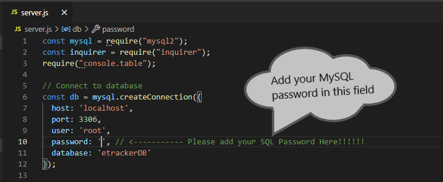
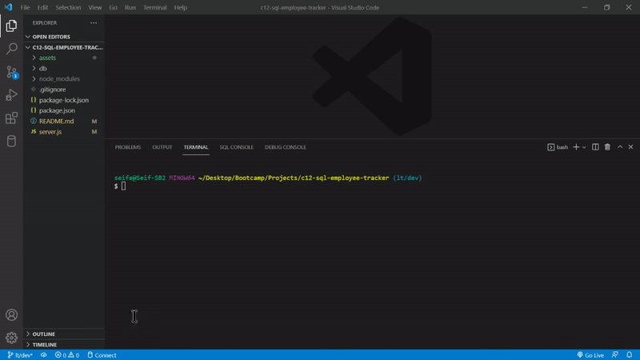

  # c12-SQL-Employee-Tracker  
  
  

  ## Description  
  This is a command-line application that uses an interface known as Content Management Systems (CMS) to manage a company's database of employees using Node.js, Inquirer, and MySQL.

  ## Table of Contents 
  * [description](#description)
  * [installation](#installation)
  * [usage](#usage)
  * [questions](#questions)
  * [license](#license)
  
  ## Installation
  First, ensure Node.js is installed on your machine. Next, please download my repo file. Then, navigate into the `server.js` file and locate the database connection password section on line 10. Make sure to update the password string field to include your MySQL password. Next, open your terminal and navigate to the root of the repo folder and install dependencies by typing `npm i` in order to begin. 

  ## Usage 
  After successful installation, type `mysql -u root -p` in your terminal to initialize MySQL. Next, login with your MySQL password. Then, type `source db/schema.sql` to initialize the database schema, and `source db/seeds.sql` to initially seed our database. Finally, type `node server.js` to initialize the application.

  ### Application Features
  - View Departments
  - View Roles
  - View Employees
  - Add new Department
  - Add new Role
  - Add new Employee
  - Update Employee
  - Remove Employee
  - Remove Role
  - Remove Department

  [Video Demonstration](https://drive.google.com/file/d/1LsklopwsTss6mB0cRHaWTnrl8oIxvx7u/view?usp=sharing)

  

  

  ## Questions
  To check out more of my projects, visit my [GitHub](https://github.com/seifenan) page.
  To reach me with more questions email me at seifenan@gmail.com. 

  [GitHub Repo](https://github.com/Seifenan/c12-sql-employee-tracker)

  ## License
  
  
  
